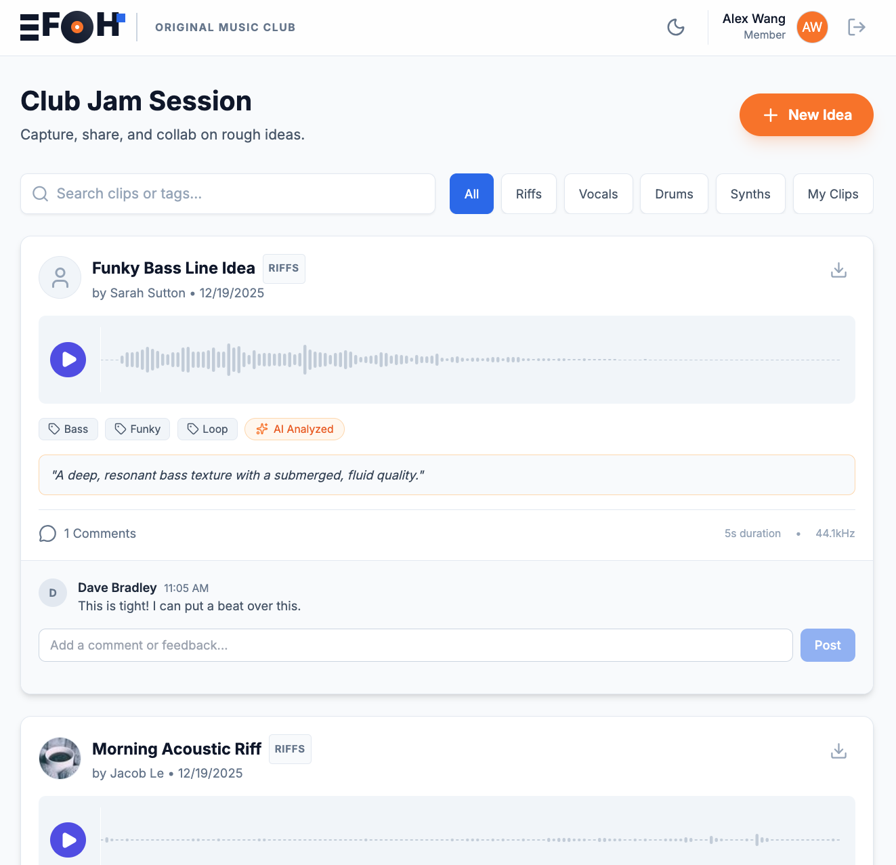
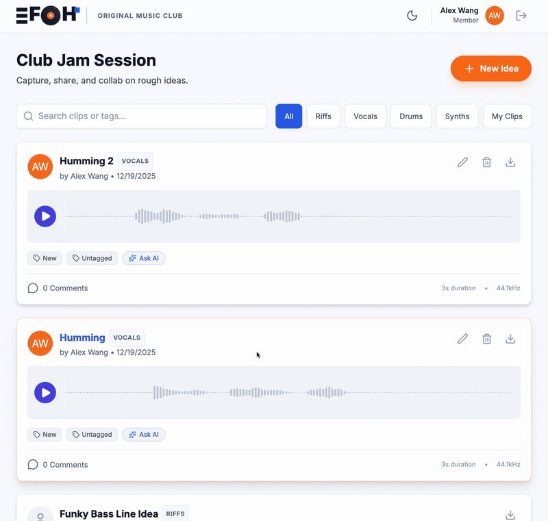
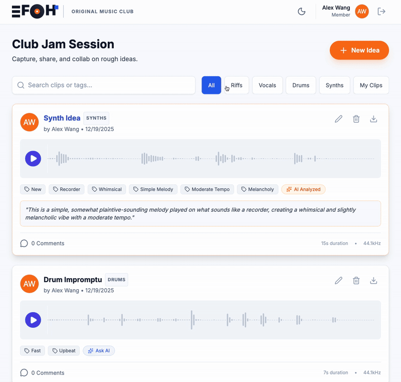

# JamBoard

JamBoard is a lightweight web app designed to help musicians capture, organize,
and collaborate on musical ideas during jam sessions.

Inspired by my experience founding and leading the EFGH Original Music Club at the
University of Florida, I built JamBoard to support the club’s current leadership
and make it easier for musicians to share riffs, melodies, and song ideas in a
low-friction, collaborative way.

## Motivation
While running jam sessions and open mics for EFGH Original Music Club, I noticed that
members often came in with great musical ideas but had no easy way to capture,
revisit, or collaborate on them after a session.

JamBoard was created to solve that problem by providing a simple, musician-friendly
tool for recording short ideas, tagging them, and sharing feedback with others.

## Features
- Record short musical ideas directly in the browser
- Set categories (e.g. riffs, vocals, drums, etc.)
- Tag ideas (e.g. acoustic, chorus, rhythm)
- Browse and replay shared clips
- Comment and collaborate on ideas
- Clean, minimal UI designed for musicians

## Screenshots




## Tech Stack
- Frontend: React
- Backend: Node.js
- APIs: Gemini (for AI-powered features)
- Tooling: npm, environment-based config

## How to Run
This project can be run locally for development and testing.

### Prerequisites
- Node.js (v18 or later recommended)
- npm

### Setup

1. Clone the repository:
   ```bash
   git clone https://github.com/Kunyao-Alex/jamboard-music-collab.git
   cd jamboard-music-collab

2. Install dependencies:
    ```bash
    npm install

3. Create a .env.local file in the project root and add your API key:
    ```env
    GEMINI_API_KEY=your_api_key_here

4. Start the development server:
    ```bash
    npm run dev

5. Open your browser and navigate to:
    ```link
    http://localhost:3000

## Project Status
JamBoard is an early-stage prototype focused on exploring user experience and
collaboration workflows for music creation. Future improvements could include
multi-track support, real-time collaboration, and cloud-based audio storage.
